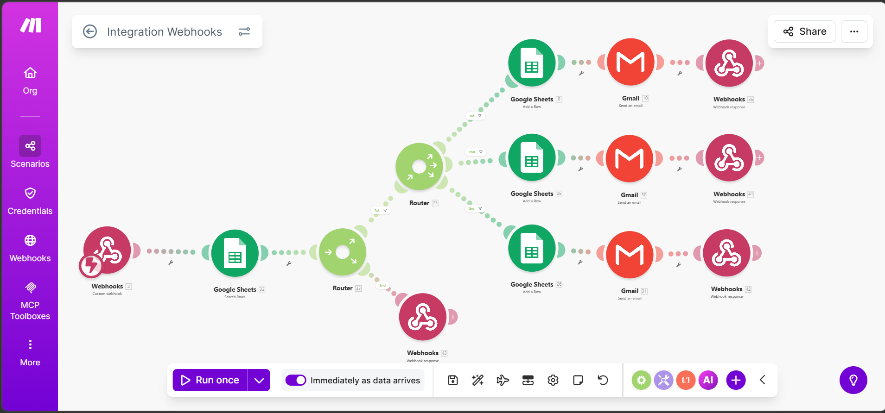

# AI Automation Workflows

A collection of automation workflows built using no-code and low-code tools to automate business processes such as lead management, notifications, and data handling.

These workflows demonstrate how different applications can be connected to create automated systems that reduce manual work and improve efficiency.

---

## Project Overview

This repository contains automation scenarios that integrate multiple tools to automate real-world tasks such as:

- Capturing leads from forms
- Storing and managing data
- Sending automated email notifications
- Updating records automatically

---

## Lead Management Automation

This workflow automatically manages leads submitted through a form.

### Workflow Process

1. A user submits a lead through **Google Forms**
2. The system checks if the lead already exists in **Google Sheets**
3. If the lead is new:
   - A new row is added in the sheet
   - A confirmation email is sent
4. If the lead already exists:
   - The existing record is updated
   - A notification email is sent

---

## Tools Used

- Google Forms
- Google Sheets
- Gmail
- Automation platform

---

## Workflow Architecture

---

## Folder Structure
